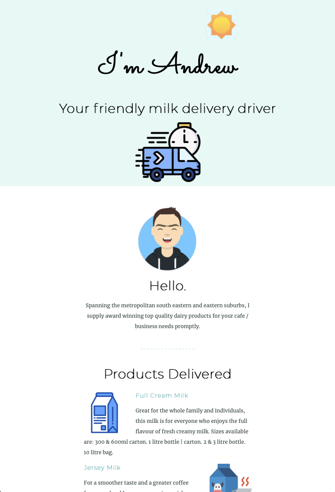

## Table of contents

-   [General info](#general-info)
-   [Link](#andrew-milk)
-   [MVP](#MVP)
-   [Future functionality](#future-functionality)
-   [Screenshots](#screenshots)
-   [In-depth Features of Task Time Boxer](#in-depth-features)
-   [Challenges](#challenges)
-   [Technologies Used](#technologies-used)
-   [Download](#download)

## General info

This basic website was quickly designed for a friend who owns and run a small milk delivery business. The business owner essentially relies on "word of mouth" for new sales.

He wanted something basic that he may wish to use later on.

## Task Time Boxer Link

-   The link to his website is:
    [http://andrewmilk.surge.sh]

## MVP

The following were the key requirements in meeting the MVP/POC.

-   a basic website with a contact button for emails that he could respond to.
-   a simple layout that captures the key products that he offers.
-   no need to list prices given the senstivity and competition from other small businesses.

## Future Functionality

Future functionality can incorporate the following:

-   A backend where customers can login and select what they would like to order.
-   This order upon submission to be submitted automatically to his email.

## Screenshots

## In depth Features

-   Purely HTML and CSS.

## Challenges

-   No real challenges for this website.
-   Just needed to create a MILK favicon.

## Technologies Used

Project is created with:

-   CSS.
-   HTML.
-   Git/Github (for version control).
-   Surge (for hosting)

## Download

Download via:

-   https://github.com/mistergjones/andrewmilk.git
